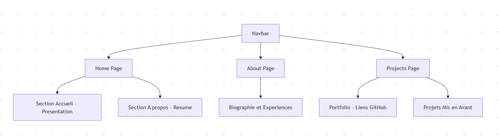

# Mini-site Portfolio Développeur
**FADNA LAKHOUCHEN**  
*Supervised by: M. Essarraj Fouad*  
*Group: DM101*

---

## Cahier de charge
**But du projet – Portfolio Yasmine :**
- **Page d’accueil fonctionnelle**
- **Profil développeuse :**
  - Identité / Rôle
  - Biographie / Parcours
  - E-mail / Contact
- **Design clair et épuré** 
- **Layout réutilisable**
- **Sections futures :** projets, compétences, contact

---

## Exemple de l’existant

---

## Diagramme de cas d’utilisation 

---

## Conception : Schéma

---

## Conception : Maquette

